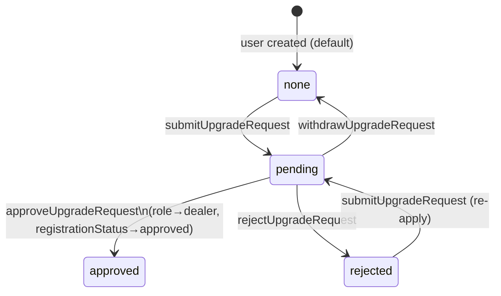

# Design Document: Customer-to-Dealer Upgrade

## Overview

This feature allows an already-authenticated customer to apply for dealer account privileges directly from their profile page — no new account creation required. The customer submits business details, the request is held in a pending state on their existing User document, an admin reviews and approves or rejects it through the existing AdminRegistrations UI, and on approval the account is seamlessly promoted to the `dealer` role.

The design deliberately reuses the existing infrastructure wherever possible:
- User document (no separate collection needed; upgrade state lives on the User)
- `protect` / `restrictTo` auth middleware
- `sendSuccess` / `sendError` response helpers
- `AuditLog` model for admin action history
- `ConfirmDialog` modal for destructive UI actions
- TanStack Query for frontend data-fetching and cache invalidation
- The existing `AdminRegistrations` page, which gains a new tab rather than a new page

The feature does **not** change the existing dealer self-registration flow (`POST /api/v1/auth/dealer/register`) or the existing login gating logic for dealers.

---

## Architecture

The feature is a thin vertical slice: a new Express router with five endpoints, a new controller module, a schema extension on the existing User model, and UI additions to two existing React pages.

```mermaid
flowchart TD
    subgraph Frontend
        P[Profile.jsx\ncustomer upgrade form / pending panel]
        AR[AdminRegistrations.jsx\n"Upgrade Requests" tab]
    end

    subgraph API
        UR[/users router\nPOST DELETE GET /me/upgrade-request]
        ADM[/admin router\nGET /upgrade-requests\nPATCH /:id/approve\nPATCH /:id/reject]
        UC[upgrade.controller.js]
    end

    subgraph DB
        UM[User document\nupgradeStatus / upgradeDetails\nupgradeRejectionReason]
        AL[AuditLog]
    end

    P  -->|TanStack Query| UR
    AR -->|TanStack Query| ADM
    UR --> UC
    ADM --> UC
    UC --> UM
    UC --> AL
```

### Request / Response Flow

```mermaid
sequenceDiagram
    participant C  as Customer Browser
    participant API as Express API
    participant DB as MongoDB

    C->>API: POST /api/v1/users/me/upgrade-request {businessName, ownerName, address}
    API->>DB: findById(req.user._id)
    API->>DB: user.upgradeStatus = "pending"; save()
    API-->>C: 200 { success: true }

    C->>API: GET /api/v1/users/me/upgrade-request
    API->>DB: findById(req.user._id).select(...)
    API-->>C: 200 { upgradeStatus, upgradeDetails, upgradeRejectionReason }

    Note over C,API: Admin flow
    C->>API: PATCH /api/v1/admin/upgrade-requests/:id/approve
    API->>DB: user.role="dealer"; save()
    API->>DB: AuditLog.create(...)
    API-->>C: 200 { success: true }
```

---

## Components and Interfaces

### Backend

#### `backend/src/modules/users/upgrade.controller.js`

Exports five named handler functions consumed by the two routers.

| Export | Method | Path | Middleware |
|---|---|---|---|
| `submitUpgradeRequest` | POST | `/api/v1/users/me/upgrade-request` | protect |
| `withdrawUpgradeRequest` | DELETE | `/api/v1/users/me/upgrade-request` | protect |
| `getUpgradeStatus` | GET | `/api/v1/users/me/upgrade-request` | protect |
| `listUpgradeRequests` | GET | `/api/v1/admin/upgrade-requests` | protect + restrictTo |
| `approveUpgradeRequest` | PATCH | `/api/v1/admin/upgrade-requests/:id/approve` | protect + restrictTo |
| `rejectUpgradeRequest` | PATCH | `/api/v1/admin/upgrade-requests/:id/reject` | protect + restrictTo |

**Zod schemas defined inside the controller:**

```js
// Submit body
const submitSchema = z.object({
  businessName: z.string().min(2).max(100),
  ownerName:    z.string().min(2).max(100),
  address:      z.string().min(5).max(300),
});

// Admin list query
const listQuerySchema = z.object({
  status: z.enum(['pending', 'approved', 'rejected']).default('pending'),
  page:   z.coerce.number().int().min(1).default(1),
  limit:  z.coerce.number().int().min(1).max(100).default(20),
});

// Reject body
const rejectBodySchema = z.object({
  rejectionReason: z.string().max(500).optional().default(''),
});
```

#### `backend/src/routes/users.js`

New Express router for customer-facing user endpoints. Applies `protect` on each route. Mounted at `/users` in `backend/src/routes/index.js`.

```js
router.post('/me/upgrade-request',    protect, upgrade.submitUpgradeRequest);
router.delete('/me/upgrade-request',  protect, upgrade.withdrawUpgradeRequest);
router.get('/me/upgrade-request',     protect, upgrade.getUpgradeStatus);
```

#### `backend/src/routes/admin.js` (additions)

Three new routes appended to the existing admin router (already protected by `protect` + `restrictTo`):

```js
router.get('/upgrade-requests',               upgrade.listUpgradeRequests);
router.patch('/upgrade-requests/:id/approve', upgrade.approveUpgradeRequest);
router.patch('/upgrade-requests/:id/reject',  upgrade.rejectUpgradeRequest);
```

### Frontend

#### `src/pages/Profile.jsx` (modification)

Adds a conditional `<DealerUpgradeSection>` rendered only when `user.role === 'customer'`. The section is self-contained: it owns its own TanStack Query (`['my-upgrade-request']`) and mutation state.

**Internal state machine:**

```
upgradeStatus:
  "none"     → show application form
  "rejected" → show rejection reason banner + application form
  "pending"  → show read-only pending panel + Withdraw button
  "approved" → section hidden (user is now dealer, role badge reflects it)
```

#### `src/pages/admin/AdminRegistrations.jsx` (modification)

Adds an `"upgrade"` view alongside the existing dealer-registration tabs. When the "Upgrade Requests" tab is selected:
- Separate `useQuery(['upgrade-requests', { status, page }])` targets `/admin/upgrade-requests`
- Separate `useQuery(['upgrade-requests-count'])` targets `/admin/upgrade-requests?status=pending&limit=1` for the tab badge
- Approve / Reject mutations invalidate `['upgrade-requests']`
- Cards show: phone, profile.name (if present), businessName, ownerName, address, appliedAt

---

## Data Models

### User Schema Extension

The following three top-level fields are added to `UserSchema` in `backend/src/modules/users/user.model.js`. No migration script is needed; Mongoose schema defaults populate missing values on read.

```js
upgradeStatus: {
  type:    String,
  enum:    ['none', 'pending', 'approved', 'rejected'],
  default: 'none',
},
upgradeRejectionReason: {
  type:    String,
  default: null,
},
upgradeDetails: {
  businessName: { type: String },
  ownerName:    { type: String },
  address:      { type: String },
  appliedAt:    { type: Date },
},
```

All existing fields remain untouched. `registrationStatus`, `rejectionReason`, `role`, `isVerified`, etc. are managed by the existing flows and continue to work as before.

### State Transition Diagram



### Field Projection for API Responses

All upgrade-related endpoints select only safe fields. The `password` field is never returned:

**Customer endpoint (GET /me/upgrade-request):**
```
upgradeStatus, upgradeRejectionReason, upgradeDetails
```

**Admin list endpoint (GET /admin/upgrade-requests):**
```
_id, profile, phone, role, upgradeStatus, upgradeRejectionReason, upgradeDetails, createdAt
```

### AuditLog Entries

| Action | Fields stored |
|---|---|
| `APPROVE_DEALER_UPGRADE` | `adminId`, `action`, `targetId: user._id` |
| `REJECT_DEALER_UPGRADE` | `adminId`, `action`, `targetId: user._id`, `details: { rejectionReason }` |

Note: the AuditLog `details` field schema uses `oldValue`/`newValue` keys for general updates, but existing audit calls (e.g. `REJECT_DEALER`) store arbitrary keys in `details`. This controller stores `{ rejectionReason }` in `details` directly, consistent with the `rejectDealer` pattern in `user.admin.controller.js`.

---

## Correctness Properties

*A property is a characteristic or behavior that should hold true across all valid executions of a system — essentially, a formal statement about what the system should do. Properties serve as the bridge between human-readable specifications and machine-verifiable correctness guarantees.*


### Property 1: Schema default for missing upgradeStatus

*For any* User document that was created without an explicit `upgradeStatus` value (i.e., all pre-existing records), reading `upgradeStatus` SHALL return `"none"` via the Mongoose schema default — the field is never `undefined` or `null`.

**Validates: Requirements 1.5**

---

### Property 2: Upgrade request input validation correctness

*For any* triple `(businessName, ownerName, address)`, the Zod upgrade-request schema SHALL accept the input if and only if `businessName.length ∈ [2, 100]`, `ownerName.length ∈ [2, 100]`, and `address.length ∈ [5, 300]`; any triple that violates at least one constraint SHALL produce a validation error, and any triple that satisfies all constraints SHALL pass validation. This holds identically for both the backend Zod schema and the frontend Zod resolver.

**Validates: Requirements 2.2, 8.6, 12.1**

---

### Property 3: Role guard on upgrade submission

*For any* authenticated user whose `role` is not `"customer"` (i.e., role is one of `"admin"`, `"editor"`, `"sales_partner"`, or `"dealer"`), submitting a POST to `/api/v1/users/me/upgrade-request` SHALL return HTTP 403.

**Validates: Requirements 2.4**

---

### Property 4: Submit upgrade request persists state correctly

*For any* user with `role: "customer"` and `upgradeStatus` in `["none", "rejected"]`, and *for any* valid input triple `(businessName, ownerName, address)` that passes validation, after `submitUpgradeRequest` succeeds: `upgradeStatus` SHALL be `"pending"`, `upgradeDetails.businessName` SHALL equal the submitted value, `upgradeDetails.ownerName` SHALL equal the submitted value, `upgradeDetails.address` SHALL equal the submitted value, and `upgradeDetails.appliedAt` SHALL be a recent timestamp.

**Validates: Requirements 2.7**

---

### Property 5: Submit-then-read round-trip

*For any* valid upgrade submission, calling `GET /api/v1/users/me/upgrade-request` after a successful `POST /api/v1/users/me/upgrade-request` SHALL return the same `businessName`, `ownerName`, `address`, and `upgradeStatus: "pending"` that were submitted.

**Validates: Requirements 4.2**

---

### Property 6: Submit-then-withdraw round-trip (full state reset)

*For any* user who has successfully submitted an upgrade request (upgradeStatus is `"pending"`), after a successful `DELETE /api/v1/users/me/upgrade-request`: `upgradeStatus` SHALL be `"none"`, and `upgradeDetails.businessName`, `upgradeDetails.ownerName`, `upgradeDetails.address`, and `upgradeDetails.appliedAt` SHALL each be `null`.

**Validates: Requirements 3.3, 3.4**

---

### Property 7: Password never present in any upgrade API response

*For any* user in any `upgradeStatus` state, the response payloads from `GET /api/v1/users/me/upgrade-request`, `GET /api/v1/admin/upgrade-requests`, `PATCH /api/v1/admin/upgrade-requests/:id/approve`, and `PATCH /api/v1/admin/upgrade-requests/:id/reject` SHALL never contain a `password` field at any level of nesting.

**Validates: Requirements 4.4, 5.6, 12.7**

---

### Property 8: Admin list filter correctness

*For any* database state containing users with varying `upgradeStatus` and `role` values, the response from `GET /api/v1/admin/upgrade-requests` SHALL satisfy:
- When `status=pending` or `status=rejected`: every returned user SHALL have `role: "customer"`, `upgradeStatus` matching the requested status, and `isDeleted: false`.
- When `status=approved`: every returned user SHALL have `role: "dealer"`, `upgradeStatus: "approved"`, and `isDeleted: false`.
- No user failing these conditions SHALL appear in the results.

**Validates: Requirements 5.3, 5.4**

---

### Property 9: Admin list sort order

*For any* set of upgrade requests returned by `GET /api/v1/admin/upgrade-requests`, the results SHALL be sorted by `upgradeDetails.appliedAt` in descending order — for any two adjacent results `r[i]` and `r[i+1]`, `r[i].upgradeDetails.appliedAt >= r[i+1].upgradeDetails.appliedAt`.

**Validates: Requirements 5.5**

---

### Property 10: Approve sets all required fields correctly

*For any* user with `upgradeStatus: "pending"`, after `approveUpgradeRequest` succeeds, the User document SHALL have `role: "dealer"`, `upgradeStatus: "approved"`, `registrationStatus: "approved"`, and `isVerified: true`.

**Validates: Requirements 6.4**

---

### Property 11: Approve conditional field copy

*For any* user approved via `approveUpgradeRequest`:
- `profile.shopName` SHALL equal `upgradeDetails.businessName` if and only if `profile.shopName` was `null`, `undefined`, or `""` before approval; otherwise `profile.shopName` SHALL remain unchanged.
- `profile.address` SHALL equal `upgradeDetails.address` if and only if `profile.address` was `null`, `undefined`, or `""` before approval; otherwise `profile.address` SHALL remain unchanged.

**Validates: Requirements 6.5**

---

### Property 12: Reject preserves customer role and stores reason

*For any* user with `upgradeStatus: "pending"` and *for any* rejection reason string (including the empty string `""`), after `rejectUpgradeRequest` succeeds: `upgradeStatus` SHALL be `"rejected"`, `upgradeRejectionReason` SHALL equal the provided reason (or `""` if not provided), and `role` SHALL remain `"customer"`.

**Validates: Requirements 7.4, 7.5**

---

### Property 13: Customer login not blocked by upgradeStatus

*For any* user with `role: "customer"` and *for any* value of `upgradeStatus` (including `"pending"`, `"rejected"`, `"approved"`, `"none"`), the login handler SHALL NOT apply the `registrationStatus` gate — the customer SHALL receive tokens normally if their credentials are correct.

**Validates: Requirements 10.1, 10.2, 10.3**

---

### Property 14: Post-approval JWT contains updated role

*For any* user whose `role` was changed to `"dealer"` via upgrade approval, generating a new access token (via login or refresh) SHALL produce a JWT whose payload contains `role: "dealer"`.

**Validates: Requirements 11.1**

---

## Error Handling

### Backend Error Handling Strategy

Every async controller handler is wrapped in a `try/catch`. The catch block always calls `sendError(res, 500, err.message)`. This follows the project-wide convention in `auth.controller.js` and `user.admin.controller.js`.

Non-fatal side effects (AuditLog writes) are fire-and-forget: the controller does not `await` audit writes inside the critical path's try block, or wraps them in a nested try/catch to prevent audit failures from rolling back the primary operation and returning 500 to the caller.

**Specific error conditions:**

| Condition | Status | Message |
|---|---|---|
| Zod validation failure (body) | 400 | `'Validation failed'` + `fieldErrors` |
| Zod validation failure (query) | 400 | `'Validation failed'` + `fieldErrors` |
| Role is not `"customer"` | 403 | `'Only customers can apply for a dealer upgrade.'` |
| upgradeStatus already `"pending"` (on submit) | 409 | `'An upgrade request is already pending.'` |
| upgradeStatus already `"approved"` (on submit) | 409 | `'Your account has already been upgraded to dealer.'` |
| No pending request to withdraw | 409 | `'No pending upgrade request to withdraw.'` |
| User not found / isDeleted (admin actions) | 404 | `'User not found.'` |
| No pending request (admin approve/reject) | 409 | `'No pending upgrade request for this user.'` |
| Unexpected server error | 500 | `err.message` |

### Frontend Error Handling Strategy

Each query and mutation in the frontend follows the existing project patterns:

- **Query loading** → skeleton placeholder rendered in place of the section
- **Query error** → error message + retry button rendered in place of the section, without affecting the rest of the page
- **Mutation error** → inline error displayed below the form or within the panel; no navigation; dialog does not close automatically on mutation failure
- **Mutation in-flight** → submit/withdraw button disabled and shows a spinner

---

## Testing Strategy

### Unit Tests

Unit tests cover specific examples, edge cases, and error conditions that property tests do not hit:

**Backend — `upgrade.controller.js`:**
- Submit: role guard (403 for dealer, admin, editor, sales_partner)
- Submit: duplicate-pending guard (409)
- Submit: already-approved guard (409)
- Withdraw: no-pending guard (409)
- Approve: user-not-found guard (404)
- Approve: not-pending guard (409)
- Reject: user-not-found guard (404)
- Reject: not-pending guard (409)
- GET status: returns `upgradeDetails: {}` when upgradeStatus is `"none"`
- AuditLog write failure on approve does not change HTTP 200 response
- AuditLog write failure on reject does not change HTTP 200 response

**Frontend — Profile.jsx upgrade section:**
- Renders nothing when `user.role !== "customer"`
- Skeleton shown during query loading
- Error state + retry button shown on query error
- Rejection reason banner shown above form when `upgradeStatus: "rejected"` and reason is non-empty
- Pending panel shows submitted details (businessName, ownerName, address, appliedAt)
- ConfirmDialog opens on "Withdraw Application" click
- API error displayed inline after submit mutation failure

**Frontend — AdminRegistrations.jsx upgrade tab:**
- Badge count reflects `total` from the count query
- Empty state message "No pending upgrade requests." when list is empty
- Pagination controls hidden when total ≤ 20
- `profile.name` field hidden when absent from API response

### Property-Based Tests

The project uses JavaScript as its language. The property-based testing library is **[fast-check](https://fast-check.dev/)** — a well-maintained, TypeScript-compatible PBT library for the JS ecosystem.

Each property test runs a **minimum of 100 iterations** (fast-check default `numRuns: 100`). Each test is tagged with a comment referencing its design property.

**Tag format:** `// Feature: customer-dealer-upgrade, Property N: <property_text>`

**Properties to implement as PBT tests:**

| Property # | What to generate | What to assert |
|---|---|---|
| P1 | User objects without `upgradeStatus` field | `user.upgradeStatus === 'none'` |
| P2 | Strings of arbitrary length for each of businessName/ownerName/address | Zod parse result matches expected validity |
| P3 | User objects with role ∈ {admin, editor, sales_partner, dealer} | Controller returns 403 |
| P4 | Valid input triples + user in none/rejected state | All four `upgradeDetails` fields saved correctly, `upgradeStatus='pending'` |
| P5 | Valid input triples | GET after POST returns same data |
| P6 | Valid submissions | DELETE after POST resets all upgrade fields to null/none |
| P7 | Users in any upgradeStatus | No `password` key in response at any nesting level |
| P8 | Mixed user databases + status params | All results match role/upgradeStatus/isDeleted filter |
| P9 | Multiple upgrade requests with varying appliedAt | Results sorted descending by appliedAt |
| P10 | Users with upgradeStatus='pending' | After approve: role='dealer', upgradeStatus='approved', registrationStatus='approved', isVerified=true |
| P11 | Users with varying profile.shopName / profile.address | Conditional copy logic correct post-approve |
| P12 | Users with upgradeStatus='pending' + arbitrary reason strings | After reject: upgradeStatus='rejected', reason preserved, role='customer' |
| P13 | Customer users with any upgradeStatus value | Login handler does not apply dealer registration gate |
| P14 | Users approved as dealer | New JWT payload contains role='dealer' |

### Integration Tests

Integration tests cover the wiring between the routers and the controller (1-3 representative examples each):

- `protect` middleware rejects unauthenticated requests for all six endpoints
- `restrictTo('admin', 'editor')` rejects customer tokens on admin endpoints
- `GET /api/v1/admin/upgrade-requests` with `status=pending` returns correct shape
- `PATCH /admin/upgrade-requests/:id/approve` triggers role change end-to-end in a test DB

### Smoke Tests

- Schema paths for `upgradeStatus`, `upgradeRejectionReason`, and `upgradeDetails` exist on the User model
- `upgradeStatus` defaults to `"none"` on `User.create({...})` without specifying the field
- All five endpoints respond correctly to requests with valid tokens (no 500 errors on happy-path)
